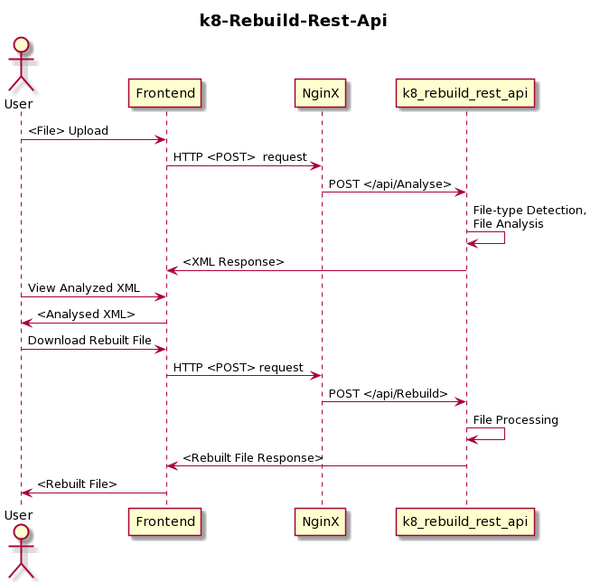

# K8 Rebuild REST API
## Setup

- clone the repo    
    `git clone https://github.com/k8-proxy/k8-rebuild-rest-api.git`
- update modules    
    `git submodule update --init`


## Endpoints
- Endpoint  
    `/api/rebuild/file`
- This endpoint allows a client service to send a unprotected file using multipart form upload and returns a protected file as an output.
- This endpoint does the following:
    - Receives the file as mutlipart bytes array and rebuilds it.
        - If it is unsuccessful, it returns `BAD REQUEST` 
        - If it is successful, it will send the file to the core engine.
    - File name is extracted from the URL.
    - The core engine will then try and determine the file type.
    - The file is rebuilt with the default content management flags for the file type.
    - Protected file is returned.

## Deployment
There are 2 ways to deploy K8 Rebuild Rest API; docker and runtime. Below are instructions for both docker and runtime deployments.

### Docker Deployment
- Change your directory     
    `cd k8-rebuild-rest-api`
- Build and run the docker image
    ```
    docker build -t sow-rest-api --file Source/Service/Dockerfile .
    docker run -it --rm -p 80:80 sow-rest-api
    ```
### Runtime Deployment
- Install the ASP.NET Core Runtime
    
    - On **Ubuntu 20.04 (LTS)**
        ```
        wget https://packages.microsoft.com/config/ubuntu/20.04/packages-microsoft-prod.deb -O packages-microsoft-prod.deb
        sudo dpkg -i packages-microsoft-prod.deb
        ```
    - Install the SDK
        ```
        sudo apt-get update; \
        sudo apt-get install -y apt-transport-https && \
        sudo apt-get update && \
        sudo apt-get install -y dotnet-sdk-5.0
        ```
    - Install the runtime
        ```
        sudo apt-get update; \
        sudo apt-get install -y apt-transport-https && \
        sudo apt-get update && \
        sudo apt-get install -y aspnetcore-runtime-3.1
        ```
    - Please check [supported distributions](https://docs.microsoft.com/en-us/dotnet/core/install/linux-ubuntu#install-the-runtime) of .NET on ubuntu.
- Change directory  
    `cd k8-rebuild-rest-api.git/Source/Service`
- Run   
    `dotnet run`

## Helm Chart
You can see the helm chart [here](https://github.com/k8-proxy/k8-rebuild-rest-api/blob/main/chart/README.md).

## Use Cases
- Process images that are retrieved from un-trusted sources
- Ability to use zip files in S3 buckets to provide the files needed to be rebuild
- Detect when files get dropped > get the file > unzip it > put all the files thought the Glasswall engine > capture all rebuilt files in one folder > capture all xml files in another folder > zip both folders > upload zip files to another S3 location

# Video Demo

https://www.youtube.com/watch?v=TlXwsJrXe68&amp;feature=youtu.be

